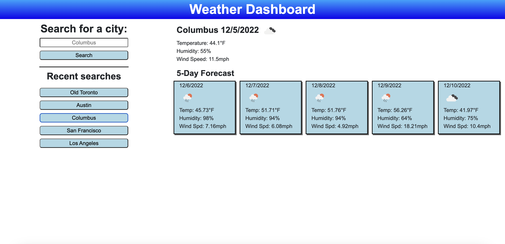

# Weather Dashboard

## Description
This app will allow users to view weather in specific cities. All they need to do is type a city into the input box and click search! The user will immediately be presented with a current day forecast along with a 5-day forecast for the following days. The user's search history is also presented on the page below the main search section. The user can select an item in their search history to view the weather for that location again.

## Live Application
The deployed webpage can be found here: https://retrotechcode.github.io/Weather-Dashboard/